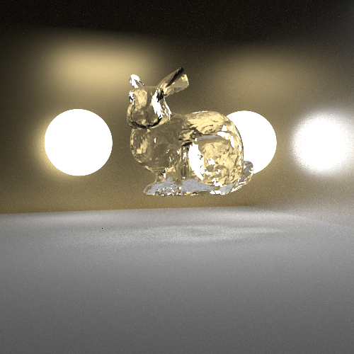
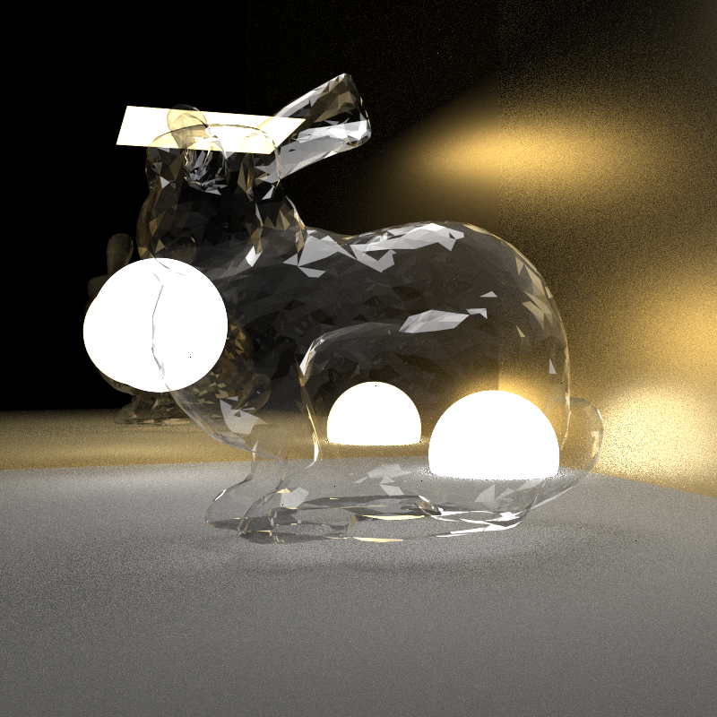

# Path Tracer

An NEE + MIS sampled path tracer, supports Marschner Hair / Phong / Dielectric / Conductor material and various Monte Carlo effects. 


> Left: Rough gold material, Right: Marschner Hair material




> Glass bunny (Approximated dielectric) with Microfacet Conductor background




>  Thin dielectric bunny with Microfacet Conductor background, using split ray for noise reduction


## Build Instructions:

This project uses CMake to build and is correctly built under M1 macOS environment. The C++ standard is set to C++ 20.

Once CMake is installed, use below commands to build with CMake.

This project uses OpenMP for parallization, for ARM Mac users, please refer to this [post][https://stackoverflow.com/questions/71061894/how-to-install-openmp-on-mac-m1] .

Add GL_SIMD to compile definition to enable SIMD (for vec and matrix class).

```
mkdir build
cd build
cmake ..
make .
```

* Unit tests are under `/tests` folder using `GTest` framework.


### MIS+NEE:

* The path tracer uses an importance sampling strategy, a mixed PDF of Material PDF and light sampling with NEE (next-event-estimation).

* Other method includes

  * An analytical calculation for Polygonal diffuse only lighting. (Ref. James Arvo)
  * Russian Roulette version MIS, w./w.o. NEE

  

### Monte Carlo and Post-processing effects:

The path tracer supports DoF, motion blur. Image filtering and tone-mapping.


### Materials:

1. Marschner Hair
2. Phong
3. Dielectric (Microfacet BxDF + simple dispersion approximation)
   * Thin Dielectric 
   * This branch introduces a split-ray variant for noise reduction.
4. Conductor (Microfacet BRDF)
5. Lambertian
6. Kajiya-Kay


### Object IO

1. .obj
2. .fbx (WIP)


### Sampler

1. Halton Sampler
2. Stratified Sampler
3. Sobol Sampler (WIP)